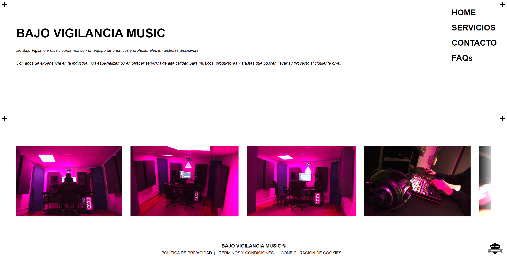

 <!-- **README genérico en Markdown** listo para copiar y pegar en tu proyecto HTML, CSS y JavaScript: -->

# 📌 BV LANDING WEB

Primera iteración de la landing page para la web del estudio de producción audiovisual Bajo Vigilancia Music.

---

## 📂 Estructura del Proyecto

```bash
BV_landing_web_Jaime_Rubio/
│
├── index.html
├── README.md
│
├── css/
│   └── styles.css
│
├── js/
│   └── script.js
│
│├── pages/
│   └── faqs.html
│
└── assets/
    ├── img/
    └── icons/
```

### 📄 Descripción de Archivos

* `index.html` → Archivo principal HTML.
* `css/styles.css` → Hoja de estilos principal.
* `js/script.js` → Lógica principal en JavaScript.
* `assets/` → Recursos estáticos como imágenes e íconos.

---

## 🚀 Instalación y Uso

### 1️⃣ Clonar el repositorio

```bash
git clone https://github.com/BV-Works/BV_landing_web_Jaime_Rubio.git
```

### 2️⃣ Acceder al directorio

```bash
cd BV_landing_web_Jaime_Rubio
```

### 3️⃣ Abrir el proyecto

Puedes abrir el archivo `index.html` directamente en tu navegador o usar una extensión como **Live Server** en VS Code.

### :globe_with_meridians: Proyecto desplegado 
Puedes ver el proyecto online en: https://bv-works.github.io/BV_landing_web_Jaime_Rubio/

---

## 🛠️ Tecnologías Utilizadas

* HTML5
* CSS3
* JavaScript (ES6+)

---

## 💻 Requisitos

* Navegador web moderno (Chrome, Firefox, Edge, etc.)
* (Opcional) Editor de código como VS Code
* (Opcional) Git instalado

---
## :wrench: Funcionalidades futuras

- Agregar un formulario de contacto funcional.
- Añadir pequeñas animaciones con transiciones CSS.
- Complementar la sección de FAQs.
- Añadir la sección Miembros, con todos los integrantes del equipo con una serie de tarjetones que cuando pinches te lleven a una pagina 
individual estilo allMyLinks o LinkTree.
- Agregar páginas politicas cookies, privacidad y condiciones de uso.
- Agregar algún tipo de lógica de negocio adicional (todavía no se cuales).
- Mejorar la accesibilidad (atributos ARIA y contraste de colores).
- Trasladar la estructura del código a React y reaprovechar allí los estilos y componentes principales.
- Mejorar el SEO.
- Optimizar imágenes para mejorar la velocidad de carga.
- Optimizar la app: SSR, deferred loading, lazy loading.
- Google Pixel, Facebook Pixel.
- Revisar textos y imágenes (Marketing).


<!-- ## 📦 Scripts (Opcional)

Si el proyecto incluye automatización con npm:

```bash
npm install
npm start
```

--- -->

<!-- ## 🎯 Funcionalidades

* ✔️ Funcionalidad 1
* ✔️ Funcionalidad 2
* ✔️ Funcionalidad 3
* 🔄 Funcionalidad futura

--- -->

## 📸 Capturas de Pantalla

```markdown

```

---

## 👤 Autor

Jaime Rubio Salmerón: [https://github.com/BV-Works](https://github.com/BV-Works) 

Email: [music@bajovigilancia.com](mailto:music@bajovigilancia.com)

---